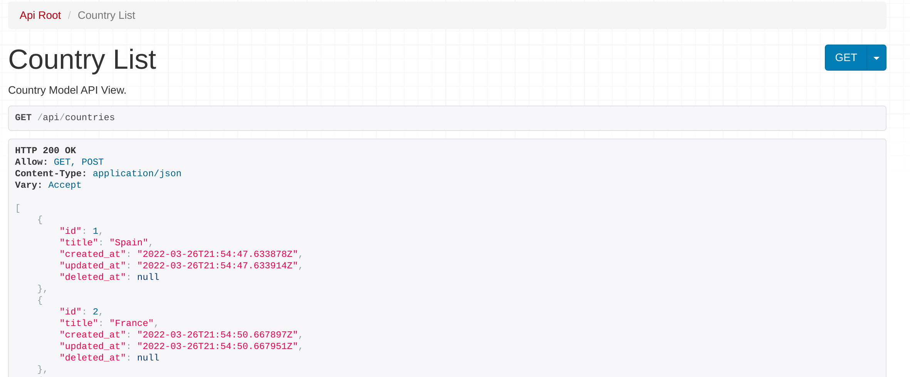
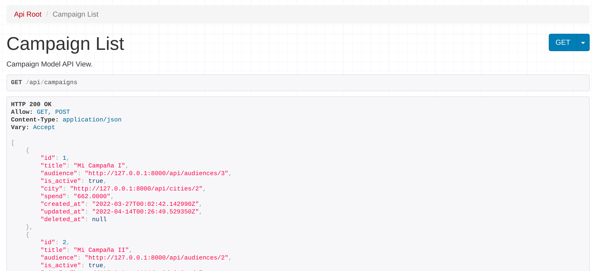
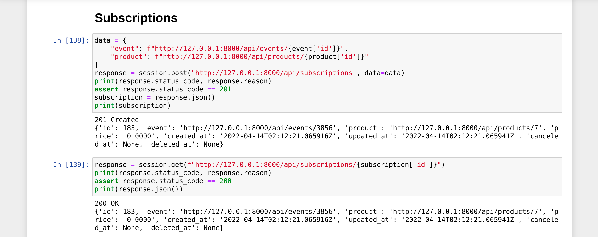

# Data Analytics
Campaign metrics analytics in Django


## Data Model


## Gallery

#### Engagement Optimization


#### Profit and Losses


#### LTV & Retention Analysis


#### Data Visualization


#### Geographic Data


#### Authentication


#### Web Scraping


#### REST API


## Installation Guide

#### Virtual Environment
```bash
virtualenv -p python3 .env
source .env/bin/activate
pip install -r requirements.txt
```

#### Create User
```bash
python3 manage.py createsuperuser
```

#### Migrations
```bash
python3 manage.py migrate
```

#### Collect Static Content
```bash
python3 manage.py collectstatic
```

#### Start Application
```bash
python3 manage.py runserver
```

#### Visit [http://127.0.0.1:8000/api/](http://127.0.0.1:8000/api/)








#### Run the Jupyter notebook
```bash
jupyter notebook
```

#### Visit [http://127.0.0.1:8000/api/](http://localhost:8888/notebooks/api.ipynb)



